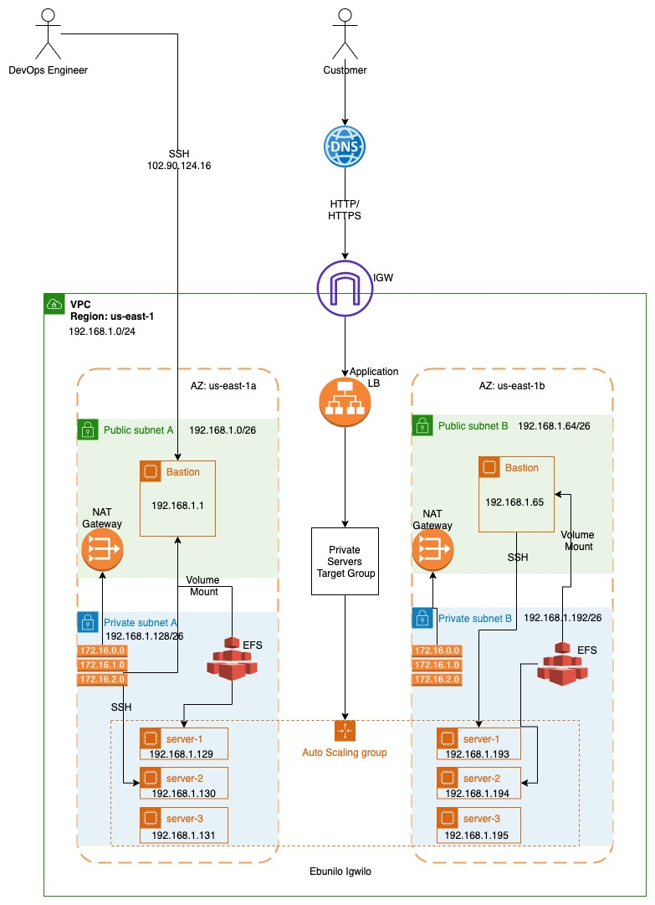

# Configuration_management

## High Availability AWS Infrastructure Project

This project demonstrates how to deploy a Highly Available Web Application on AWS with monitoring, alerting, auto scaling, load balancing, shared storage, HTTPS, and DNS configuration.

